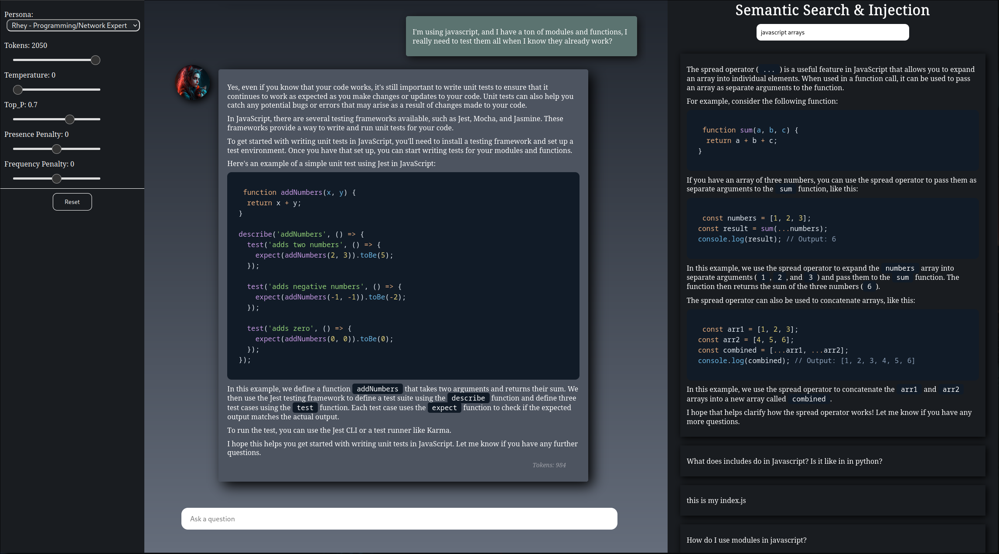

# App Description:

This app is an interface to OpenAI's gpt-3.5-turbo API with its own set of features.

## Breaking Changes:

Made changes to the .env requirements. `QUERY_URL` and `UPSERT_URL` are no longer needed. The app now only needs
`PINECONE_URL=yourindexurl`

#### Features include:

1. Mulitple personas to choose from. More to come later.
2. A very large memory for the AI to dig through. My previous version had a limit of
   around 10 previous conversations, while this version has a potential of a million+ thanks to
   Pinecone's vector database and OpenAI's embedding model.
3. Added a search and inject section to manually search vector DB and inject the data into the prompt.
4. Added textarea to upload text or notes. Format the text in markdown.

#### Roadmap:

1. Add the ability to import documents into the databases increasing the knowledge of the bots.
2. ~~Add ability for the user to use custom personas from the frontend.~~

If you have a feature you would like to see implemented, open up a discussion.

## To install:

git clone the repo:

```
git clone https://github.com/jas3333/gptchat_pinecone
cd gptchat_pinecone
npm install
```

## To run:

#### Things You Will Need:

1. An API key from Pinecone, you can setup a free account here: [Pinecone DB Website](https://www.pinecone.io/)

#### Index Setup:

    - Create a new Index
    - Use a P1
    - Dimensions: 1536

Make a note of the index location. You should see something like `indexname-2342342a.svc.us-east1-gcp.pinecone.io`. You'll need it for the
environments in the `.env`

2. An OpenAI API key to access their LLMs. This app uses gpt-3.5-turbo and Ada-002 for embedding. [OpenAI](https://openai.com)
   Their website is horrible. You'll just have to click around until you can find the signup link....

3. A MongoDB setup.

#### Setting Up:

Next you'll need to create a `.env` file, then add the following:

```
 PORT=5000 # This will change the port the express server uses.
 OPEN_AI_KEY=your-openai-key
 PINECONE_API=your-pinecone-key
 PINECONE_URL=https://indexname-2342342a.svc.us-east1-gcp.pinecone.io # Insert your index location here
 MONGODB=mongodb://localhost:27017/memories # Put in your mongodb connection string here

```

#### Running the App:

Once the .env is setup it's time to run the app. In the terminal type `node server.js` then open a browser and navigate to localhost:5000 or whatever port you
set in the .env

# Docker:

I created a docker image, the repo can be found here [Dockerhub Repo](https://hub.docker.com/r/jas313/gpt-chatbot) with instructions and a docker-compose example.


